# MacOS 在Tomcat下配置虚拟主机的步骤

```xml
环境/版本：

MacOS: BigSur_11.2.1

Tomcat: 9.044
```

```bash
前期准备：
下载安装好Tomcat9 
一个合适的编辑器，推荐Sublime Text
终端已经安装过 telnet
```

## 本教程以作业题1.14(Updated)为例演示如何配置虚拟主机

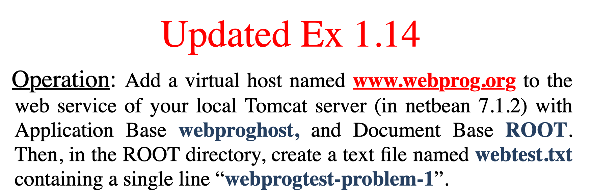

## **主要步骤**

	- [1.建立存放 webtest.txt的文件夹]()
	- [2.修改server.xml文件](Step2)
	- [3.重启tomcat]()
	- [4.使用telnet测试]()

## **建立存放 webtest.txt的文件夹**

打开apache tomcat文件夹，新建文件夹 `webproghost`, 在`webproghost`

 中新建 `ROOT` 文件夹，在`ROOT`文件夹下新建`webtest.txt`文件并且写入“webprogtest-problem-1".

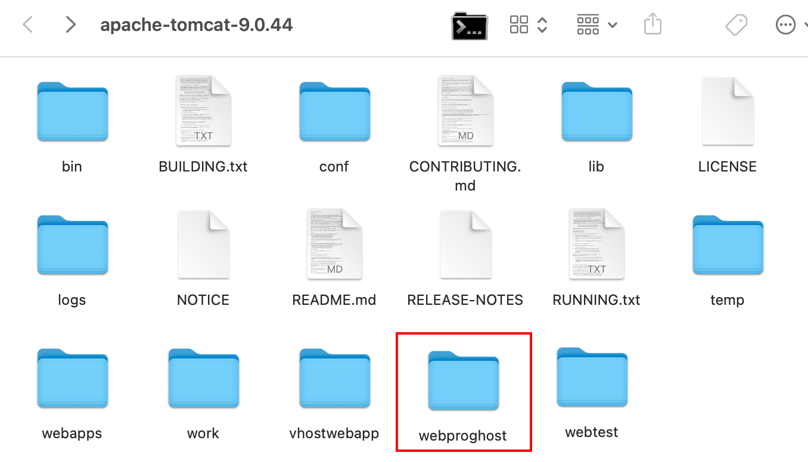

(apache tomcat 目录)

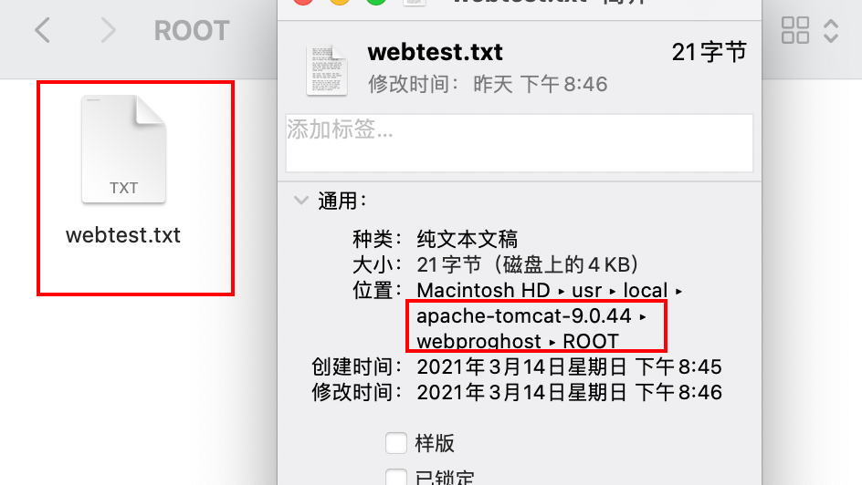

（webtest.txt)

##  修改server.xml文件

在 apache tomcat 目录下， 修改 /conf/server.xml 文件，使用一个好用的编辑器打开它，进行修改

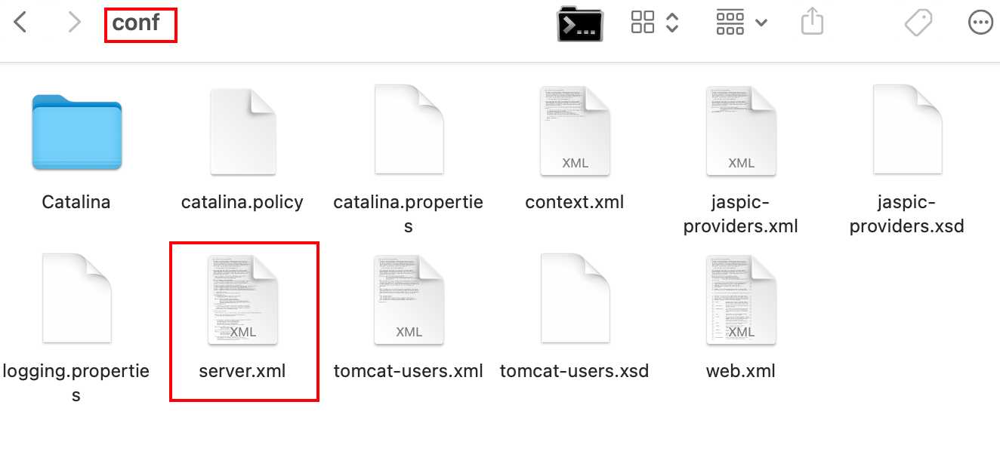


打开server.xml文件后，寻找`<Host> </Host>`标签，建议直接拉到文件最底部(`<Host>`标签位于`<Engine> </Engine>`标签内)

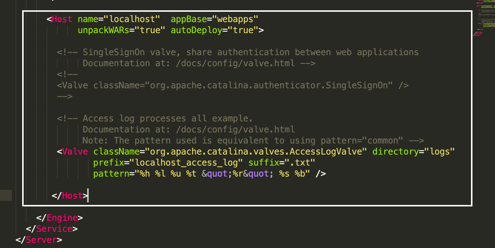


然后先来完成一段代码：

```xml
       <Host name="缺省" appBase="缺省" unpackWARs="true" autoDeploy="true" xmlValidation="false" xmlNamespaceAware="false">

       	<Context docBase="缺省" path="" />
       		
       </Host>

```

 在这段代码中，有三处为“缺省”，根据题目的意思，我们很轻易就知道，name的值为 `www.webprog.org` , appBase的值为 `webproghost` , docBase的值为 `ROOT` , 但是现在需要正确的填入appBase 和 docBase 对应的文件夹的路径. 经过反复尝试和操作，<u>**推荐appBase写相对路径**</u>，也就是 appBase="webproghost" ，这里的相对路径指的是 `webproghost` 这个文件夹相对于 `apache tomcat` 文件夹的路径. <u>**推荐docBase写绝对路径**</u>，比如docBase=“`/usr/local/apachetomcat9.0.44/webproghost/ROOT`” ，（这仅仅只是本机的ROOT文件的位置，不一定是你电脑上的路径，所以这里需要更换）要查看某个文件夹的绝对路径，只需打开一个终端，将文件夹拖入终端，终端就会显示该文件夹的绝对路径（如图）


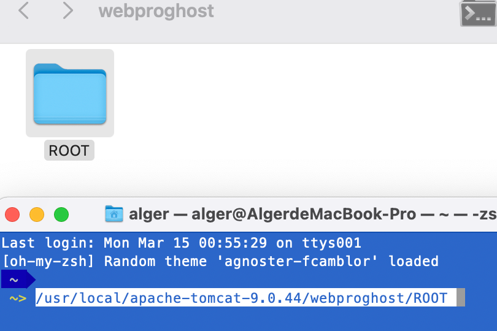


所以，最后的代码就是（其他参数可以不用管）

```xml
       </Host>

       <Host name="www.webprog.org" appBase="webproghost" unpackWARs="true" autoDeploy="true" xmlValidation="false" xmlNamespaceAware="false">

       	<Context docBase="/usr/local/apache-tomcat-9.0.44/webproghost/ROOT" path="" />
       		
       </Host>
```

将这段代码复制放到server.xml文件中(放在`<Engine> </Engine>`标签内，不要放出去了)，保存退出

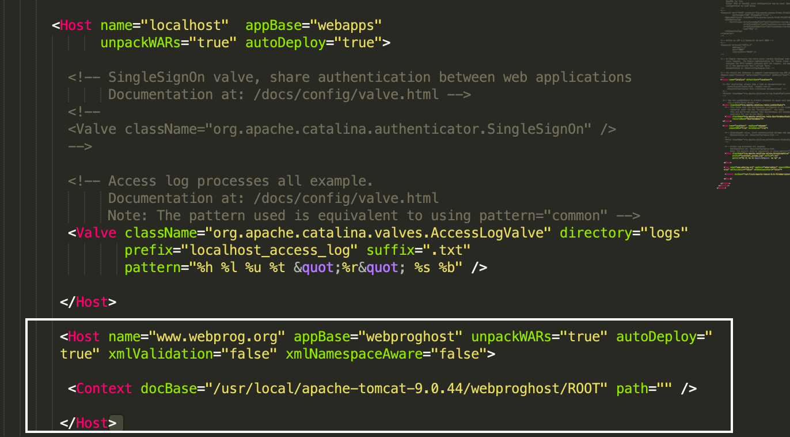

至此，server.xml文件修改完成.


## 重启tomcat

启动tomcat的方法是运行 /bin/startup.sh (相对路径，相对于tomcat目录）的脚本，（退出是运行 shutdown.sh 脚本）由于每个人安装环境不同，所以没有什么固定的命令，但是如果提前将tomcat设置在了环境变量中，就可以直接在终端输入startup.sh来启动tomcat （.sh文件，也就是脚本文件，要在终端中运行，并且使用 sh 命令才可以运行，举例 `sh startup.sh` )

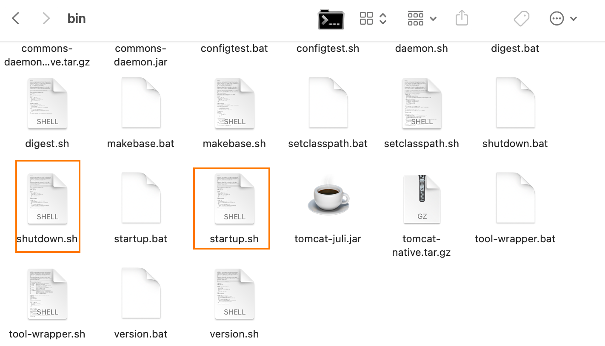

启动成功后，可以通过在浏览器输入 localhost:8080 来验证tomcat是否正常运行

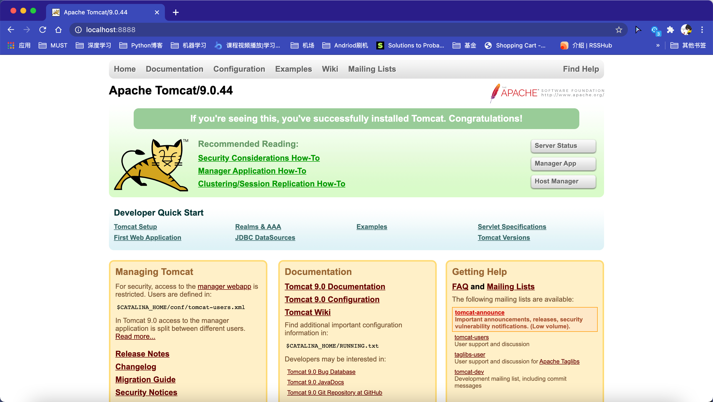

(apache tomcat的经典欢迎界面)

## 使用telnet测试

大部分人的mac上是没有安装telnet工具的，安装代码如下：

```bash
brew install telnet
```

如果终端报错，说找不到 brew 命令，说明你还没下载 Homebrew ， 可以自行去google

如果下载telnet速度很慢，多半是因为大陆网络环境问题，可以考虑切换Homebrew的源为阿里源或者清华源（这里只提供一个方向，更具体的细节可以去google), 建议是自己来澳门下载，学校的网络已经是够用的了。

成功安装好之后，先使用telnet与我们自己的本机连接

```bash
telnet localhost port
# 这里的localhost表示的是本机的ip
# 所以这个localhost也可以换成127.0.0.1
# 这个port表示你当初设置的tomcat的端口号，默认是8080
telnet 127.0.0.1 8080 
```

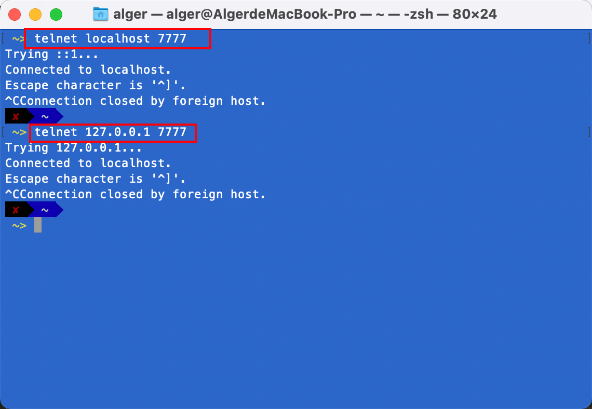

(localhost 和 127.0.0.1 都是可以连接上的)

连接上本机后，模拟浏览器发送GET请求

```bash
GET /webtest.txt HTTP/1.1
Host:www.webprog.org

```


（演示）

这是 telnet 连接本机，可以和自己的朋友做个实验，要求使用两台电脑，两台电脑连接在同一个局域网内（比如手机热点），一台使用tomcat作为服务端，将服务端的的局域网ip和tomcat端口告诉另一台设备，另一台设备充当客户端，客户端使用 `telnet 局域网ip 端口`  的命令来访问根目录下的`webtest.txt`文件 （亲测有效）


## 常见问题

1.怎么修改端口？

在`server.xml`文件中，有这样一段代码（见图），修改 port 后面的值，保存退出后，重启tomcat即可。

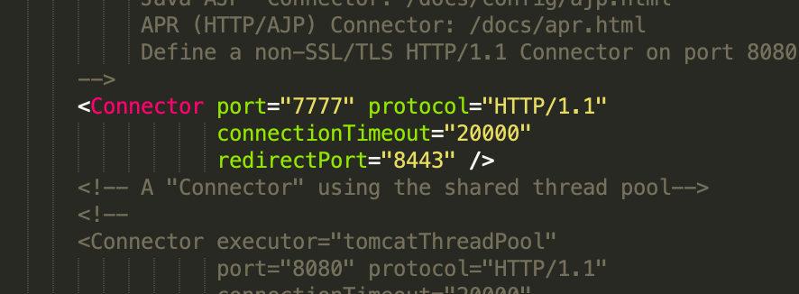


2.如何配置环境变量？

先打开终端，输入（熟悉linux可用vim ~/.bash_profile)

```bash
 open ~/.bash_profile
```

如果报错，或者没有反应，说明还没有 ~/.bash_profile文件

可以先用touch命令来创建一个，创建一个后再使用open命令（上面的命令）

```bash
 touch ~/.bash_profile
```

（bash_profile文件是macos提供给用户专门用来添加环境变量的文件，默认是没有的，需要用户自己创建）

找到自己电脑上的 tomcat 下 bin 文件夹的绝对路径，比如我的是 `/usr/local/apache-tomcat-9.0.44/bin`然后套结构`export PATH=$PATH:` , 所以我的就是：`export PATH=$PATH:/usr/local/apache-tomcat-9.0.44/bin`，自己找到自己的路径，套结构，然后代码复制粘贴到~/.bash_profile文件夹去，保存退出。此时回到中终端，输入

```bash
source ~/.bash_profile
```

这句话的意思是让刚刚建立的bash_profile文件生效

如果成功配置，此时可在终端直接输入 `startup.sh` 或者 `shutdown.sh` 来开关tomcat

3.本来tomcat正常运行，修改server.xml文件之后，tomcat不能正常运行了。

这个多半是因为修改server.xml文件不当，改变它原来的结构，或者删除了一些标签导致的，如果遇到这种问题，建议优先检查server.xml文件，可以去[官网下载](http://tomcat.apache.org/)一份一样的tomcat为难，查看默认的server.xml文件长啥样。如果上述方法不可行，这里提供几个纠错方向： 1.端口被占用，所以可以尝试修改端口，尤其是8080和8005两个端口。8080端口不建议使用，8005端口一直要保证不能被其他程序占用，否则tomcat不能成功关闭。2.java环境出故障，这种问题相对较难解决，建议重启电脑，或者重装tomcat.


如有任何疑问或者不当之处(或者补充补充添加），欢迎联系（或者pull request）。

联系方式：834818935alger@gmail.com